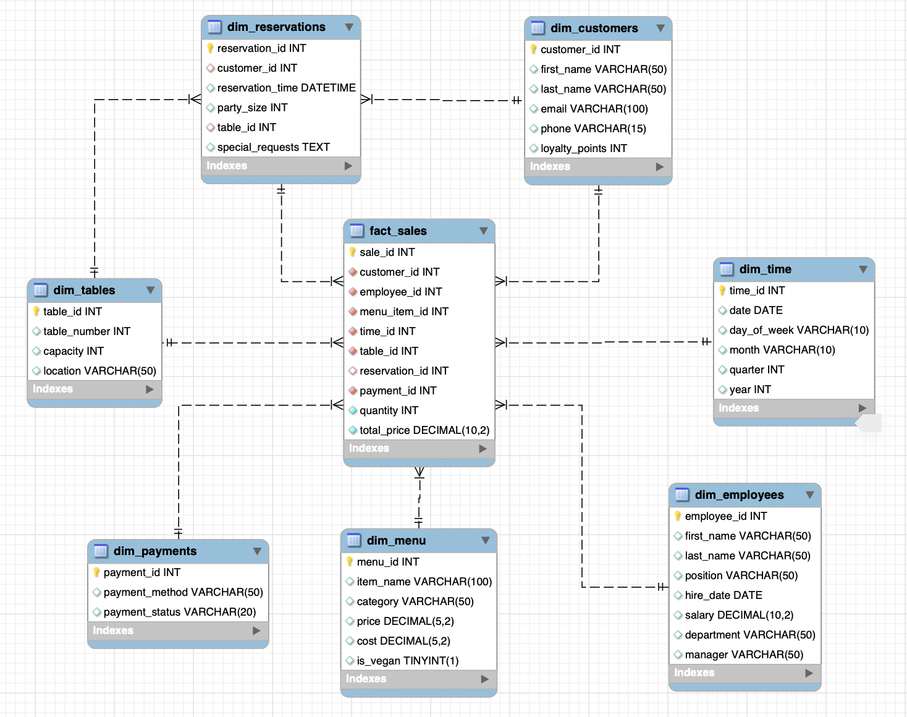
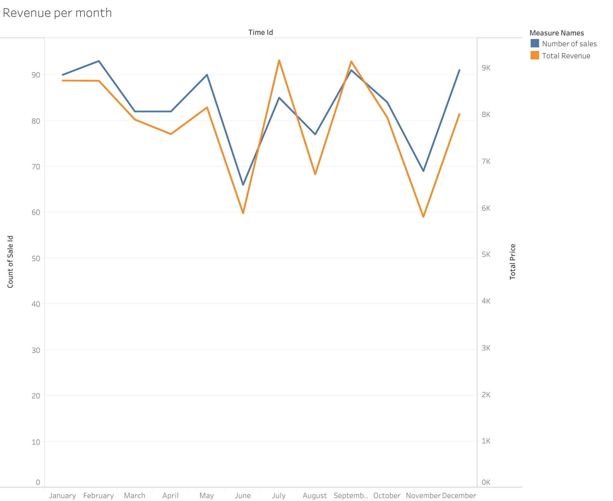
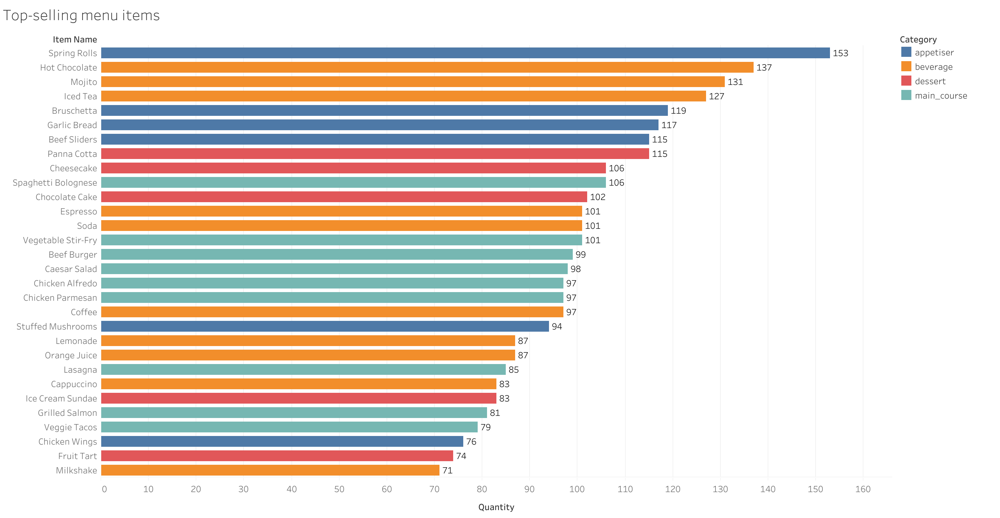
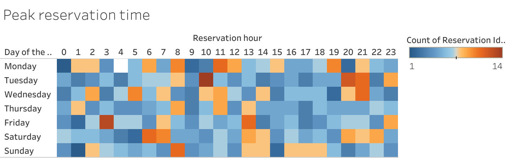

# **Restaurant Operations Database & Analytics**

## **Project Overview**
This project is designed to create a **MySQL database** for a **fictional restaurant's operations** over the course of a year (2024). It captures essential business metrics, including **sales transactions, reservations, customer details, employees, tables, payments and menu insights**. Additionally, an **interactive Tableau dashboard** visualizes key trends.

## **Technology Stack**
- **Database Engine:** MySQL
- **Data Visualization:** [Tableau Public Dashboard](https://public.tableau.com/app/profile/irina.ponomarenko/viz/RestaurantMonthlysalesrevenuetrend2024/Salesandreservationstrends2024)
- **SQL Features Used:** Tables, Relationships, updatable and non-updatable Views, Functions, Stored Procedures, multiple Joins and Subqueries.
---

## **Database Schema**
The database consists of the following tables:
- fact_sales
- dim_customers
- dim_reservations
- dim_menu
- dim_employees
- dim_tables
- dim_payments

## **Key Queries and Views**
The project includes **views and aggregation queries** to provide meaningful insights:
- reservations per day with updatable date
- highest spending customers
- biggest reservation party size
- frequent customers

It also includes **stored procedures** to simplify the data insertion (update menu prices) and **functions** to calculate the total revenue for a given date.

## **Tableau Dashboard: Insights & Visualizations**

### **📈 Monthly Sales Revenue Trend**  
- **Metric:** Tracks revenue fluctuations across months in 2024.
- **Insight:** Helps identify peak and low-performing months.

---

### **🍽 Top-Selling Menu Items**  
- **Metric:** Identifies the most popular dishes.
- **Insight:** Guides menu optimization and stock management.

---

### **📊 Peak Reservation Times Heatmap**  
- **Metric:** Displays peak hours and busiest days.
- **Insight:** Helps with staff scheduling and table management.

---

## **How to Set Up the Database**
1. Install MySQL and create a new database.
2. Run the SQL script `Restaurant_db_creation.sql` to set up tables.
3. Insert sample data using provided `INSERT` statements.
4. Run queries from `Restaurant_db_queries.sql` to generate insights.
5. Extract the data as csv files and import them into Tableau.

---

## **Conclusion**
This project helps business owners make **informed decisions** about sales, reservations, and menu performance. It can be applied to any restaurant business to: 
- ✅ Optimize staffing during peak hours.
- ✅ Adjust menu pricing based on demand.
- ✅ Run targeted loyalty programs.
- ✅ Improve table reservation efficiency.
- ✅ Forecast sales and prevent stock shortages.

By integrating SQL-powered analytics with a Tableau dashboard, restaurant owners can make smarter, data-backed business decisions.

